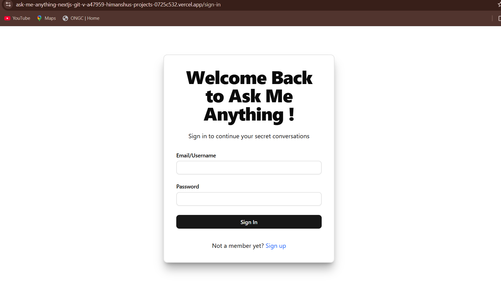
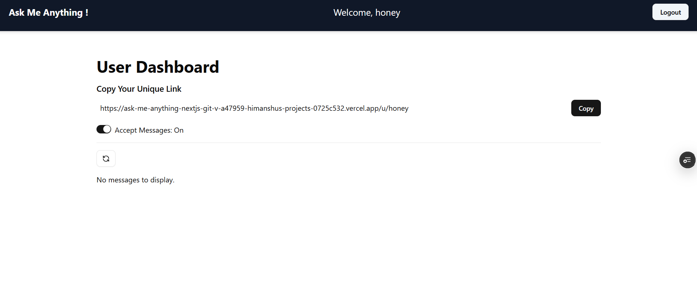
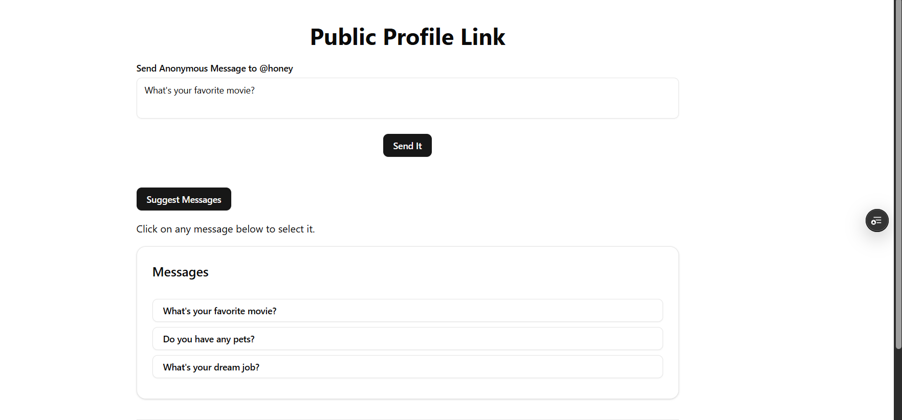
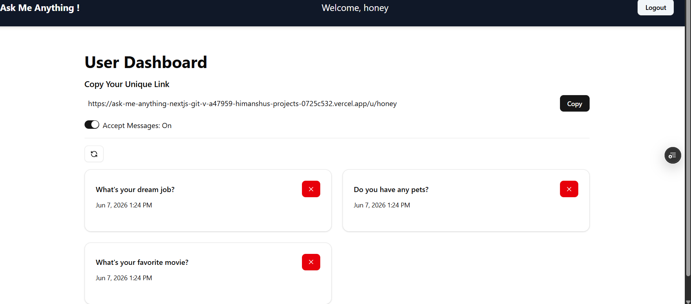

# 🚀 Anonymous Feedback & Messaging Platform

A modern anonymous messaging platform built with Next.js that allows users to receive honest feedback through a unique public profile link while maintaining complete sender anonymity.

## 🌐 Live Demo

🔗 **Live Application:** https://your-project.vercel.app

🔗 **GitHub Repository:** https://github.com/yourusername/anonymous-feedback-platform

---

## 📖 Overview

Anonymous Feedback & Messaging Platform enables users to collect honest opinions, suggestions, and feedback without revealing the sender's identity.

Users can create an account, share their personalized profile link, and start receiving anonymous messages instantly. The platform provides secure authentication, message management, and privacy-focused communication.

---

## ✨ Features

* 🔐 Secure Authentication using NextAuth
* 👤 Unique Public Profile Links
* 💬 Receive Anonymous Messages
* 📥 Message Management Dashboard
* 🗑 Delete Messages
* ⚙ Toggle Message Acceptance Settings
* 📱 Fully Responsive Design
* 🚀 Fast Performance with Next.js
* 🔒 Secure Session Management
* ☁ MongoDB Atlas Integration

---

## 🛠 Tech Stack

### Frontend

* Next.js
* TypeScript
* React.js
* Tailwind CSS

### Backend

* Next.js API Routes
* NextAuth.js

### Database

* MongoDB Atlas
* Mongoose

### Deployment

* Vercel

---

## 📸 Screenshots

### Landing Page



### User Dashboard



### Anonymous Message Form



### Message Management



---

## 🚀 Getting Started

### Clone Repository

```bash
git clone https://github.com/yourusername/anonymous-feedback-platform.git
```

### Navigate to Project Directory

```bash
cd anonymous-feedback-platform
```

### Install Dependencies

```bash
npm install
```

### Configure Environment Variables

Create a `.env.local` file and add:

```env
MONGODB_URI=your_mongodb_connection_string

NEXTAUTH_SECRET=your_nextauth_secret

NEXTAUTH_URL=http://localhost:3000
```

### Run Development Server

```bash
npm run dev
```

Open:

```text
http://localhost:3000
```

---

## 📂 Project Structure

```bash
src/
├── app/
├── components/
├── models/
├── schemas/
├── lib/
├── helpers/
├── types/
├── hooks/
└── middleware.ts
```

---

## 🔑 Core Functionality

### Authentication System

* User Registration
* Secure Login
* Session Management
* Protected Routes

### Anonymous Messaging

* Public Profile URLs
* Anonymous Message Submission
* Real-Time Message Retrieval
* Privacy Protection

### Dashboard Management

* View Messages
* Delete Messages
* Enable/Disable Message Acceptance
* Manage User Preferences

---

## 🎯 Challenges Solved

* Secure anonymous communication
* Authentication and authorization
* Database relationship management
* API route protection
* Responsive UI implementation
* Session handling with NextAuth

---

## 📈 Future Improvements

* Email Notifications
* Message Reactions
* AI-based Spam Detection
* Message Analytics Dashboard
* Theme Customization
* Real-Time Notifications

---

## 🤝 Connect With Me

### Portfolio

https://yourportfolio.vercel.app

### LinkedIn

https://linkedin.com/in/your-profile

### GitHub

https://github.com/yourusername

### Email

[your-email@example.com](mailto:your-email@example.com)

---

## 📄 License

This project is licensed under the MIT License.

---

## 👨‍💻 Author

**Himanshu Verma**

Full Stack Developer passionate about building scalable web applications and solving real-world problems through technology.


